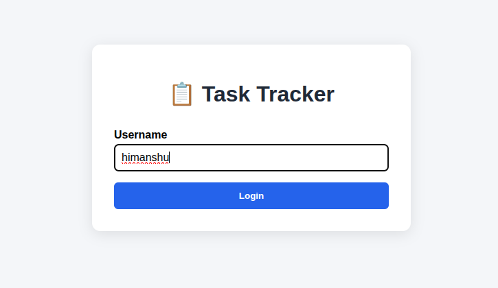
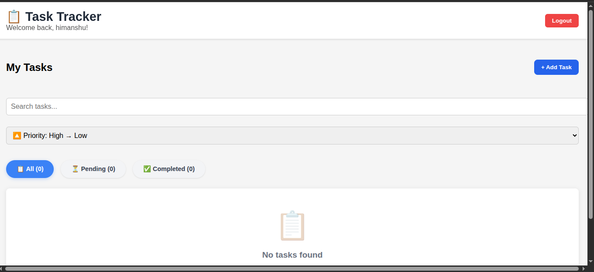
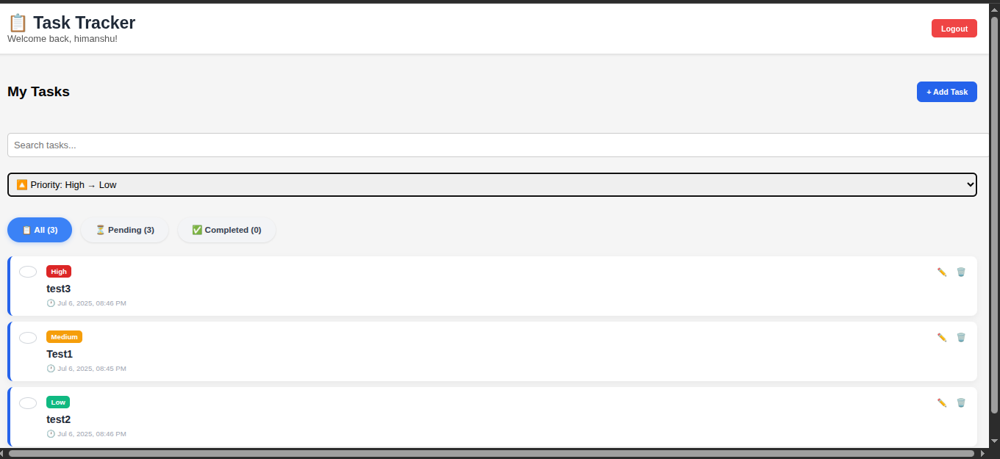

# Personal Task Tracker

## 📖 Description
A simple personal task management application built using React. Users can log in with a username, add and manage tasks, search and filter them, assign priority levels, and persist data across sessions using localStorage.

---

## 🚀 Features
- Login with username (stored in localStorage)
- Add, edit, delete tasks
- Mark tasks as completed or pending
- View task creation date/time
- Search tasks by title or description
- Filter tasks: All, Completed, Pending
- Assign priority levels: High, Medium, Low
- Sort tasks by priority or date
- Tasks persist after page refresh

---

## 🛠 Setup Instructions
1. Clone the repository  
   ```bash
   git clone https://github.com/AIbyHimanshu/task-tracker.git
   cd task-tracker

2. Install dependencies
    npm install

3. Run the application
    npm start

4. Open in your browser at
[http://localhost:3000](http://localhost:3000)


## 🧰 Technologies Used
- React.js
- HTML / CSS
- JavaScript (ES6+)
- localStorage (for persistence)

## 🔗 Live Demo
## 🔗 Live Demo
[https://AIbyHimanshu.github.io/task-tracker](https://AIbyHimanshu.github.io/task-tracker)


## 🖼️ Screenshots





## 📁 Project Structure
task-tracker/
├── public/
│   └── index.html
├── src/
│   ├── components/
│   │   ├── Login.js
│   │   ├── TaskForm.js
│   │   ├── TaskItem.js
│   │   ├── TaskList.js
│   │   └── TaskFilter.js
│   ├── utils/
│   │   └── localStorage.js
│   ├── styles/
│   │   └── App.css
│   ├── App.js
│   └── index.js
├── README.md
└── package.json


## 🙌 Author
Himanshu Yadav
GitHub Profile: https://github.com/AIbyHimanshu
